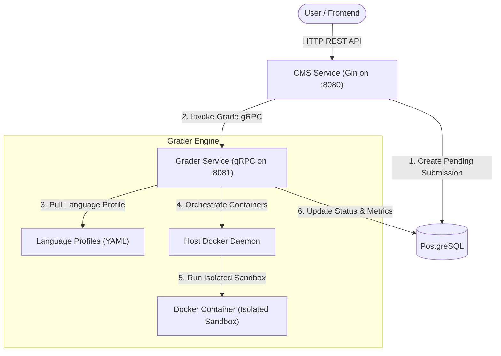

# ⚡ Gradient Backend (Go Microservices Grader Engine)

[](https://golang.org)
[](https://gin-gonic.github.io/gin/)
[](https://grpc.io)
[](https://www.postgresql.org)
[](https://www.docker.com)

**Gradient Backend** เป็นระบบหลังบ้านประสานงานและประมวลผลคำตอบ (Online Judge System) ออกแบบด้วยโครงสร้าง **Go Microservices** แบ่งแยกการจัดการ API ข้อมูลทั่วไปและการตรวจผลลัพธ์การเขียนโปรแกรมออกจากกันด้วยสัญญาสื่อสาร **gRPC** เพื่อการประมวลผลที่ปลอดภัย รวดเร็ว และรองรับโหลดจำนวนมาก

---

## 🏗️ สถาปัตยกรรมการทำงาน (System Architecture)



ระบบแบ่งออกเป็น 2 เซอร์วิสหลัก:
1.  **CMS Service (HTTP REST API)**: ดูแลการลงทะเบียนสมาชิก (Authentication), ข้อมูลบัญชีผู้ใช้, การบันทึกโจทย์ (Problems) และความสัมพันธ์ของโจทย์, จัดการสนามแข่งโปรแกรม (Contests) และการส่งคำตอบ (Submissions)
2.  **Grader Service (gRPC Server)**: ทำหน้าที่รันโค้ดผู้ใช้งานจริงในสภาพแวดล้อมที่จำกัดขอบเขต (Docker Sandbox) ป้องกันโค้ดคุกคามระบบ (Malicious Code Execution) พร้อมควบคุมปริมาณการเข้าใช้งานระบบ CPU และจำกัดทรัพยากรหน่วยความจำ (Memory Limits) และเวลาทำงาน (Timeout Limits)

---

## 📁 โครงสร้างโปรเจกต์ (Project Directory Structure)

```text
gradient-backend/
├── apps/
│   ├── cms-service/            # เซอร์วิสหลักที่คอยบริการข้อมูลให้ลูกค้าผ่าน HTTP REST API
│   │   ├── client/             # ตัวเชื่อมต่อ gRPC Client ไปหา Grader Service
│   │   ├── config/             # โหลดและจัดการการอ่านค่าสภาพแวดล้อม (.env)
│   │   ├── handler/            # API Controllers ควบคุม logic (auth, problem, contest, submission)
│   │   ├── repository/         # ติดต่อฐานข้อมูล PostgreSQL ผ่าน GORM (CRUD Operation)
│   │   ├── router/             # ตัวจัดการเส้นทางแยกตามโมดูล (Auth, Problem, Contest, Sub)
│   │   └── main.go             # จุดเริ่มต้นเปิดเซิร์ฟเวอร์หลักของ CMS Service
│   │
│   ├── grader-service/         # เซอร์วิสตรวจผลซอร์สโค้ด (Grader Engine)
│   │   ├── config/             # โหลดค่าคอนฟิกและ Sandbox Profiles (YAML)
│   │   ├── engine/             # ส่วนรันซอร์สโค้ดและควบคุม Docker Sandbox
│   │   ├── handler/            # gRPC Service Handler (Implement proto interface)
│   │   ├── repository/         # อัปเดตผลลัพธ์การตรวจและสถิติกลับลงฐานข้อมูล PostgreSQL
│   │   └── main.go             # จุดเริ่มต้นเปิด Grader gRPC Server
│   │
│   └── shared/                 # แพ็คเกจและโมเดลที่ใช้ร่วมกันของ Monorepo
│       ├── model/              # โครงสร้างตารางและ Database Entity Models
│       └── proto/              # สัญญาบริการ Grader Protobuf (.proto) และ Go code generator
│
├── database/                   # โฟลเดอร์สำหรับจัดการฐานข้อมูล
│   └── schema.sql              # ไฟล์สร้างโครงสร้างตารางเริ่มต้นทั้งหมด (PostgreSQL Table Init)
├── .env                        # ไฟล์สภาพแวดล้อมการทำงานของเครื่องท้องถิ่น
├── docker-compose.yml          # การตั้งค่าสำหรับเปิดรันระบบทั้งหมดผ่าน Docker Compose
└── README.md                   # ไฟล์เอกสารของฝั่ง Backend
```

---

## 🛡️ รายละเอียดและเทคนิคของระบบ Sandbox

ระบบตรวจข้อสอบการเขียนโปรแกรมของ **Gradient** มีการป้องกันความปลอดภัยระดับสูงเพื่อรับมือกับโค้ดอันตราย:
*   **Tar Archive Transmission**: Grader Service จะทำการแพ็คไฟล์ซอร์สโค้ดของผู้ใช้ใส่ใน `.tar` Buffer แล้วโอนย้ายข้อมูลผ่าน Docker API `CopyToContainer` โดยตรง แทนการเขียนไฟล์ผ่าน stdin redirection (`cat << 'EOF'`) เพื่อปิดโอกาสการเจาะระบบ (Shell Code Escape/Injection) และป้องกันปัญหาข้อมูลตัวอักษรตกหล่น
*   **Docker Container Sandbox Isolation**: ทุกๆ การส่งโค้ดเข้ามาตรวจ Grader Service จะสร้าง Container ของภาษานั้นขึ้นมาใหม่โดยดึง Profile จาก [sandbox_profiles.yaml](file:///Users/kong/Documents/Project/gradient/gradient-backend/apps/grader-service/config/sandbox_profiles.yaml)
*   **Strict Resource Constraints**: จำกัดหน่วยความจำและ CPU Core ของ Container ป้องกันลูปนรกทำงานตลอดเวลา โดยหากโปรแกรมทำงานเกินขีดจำกัด Grader Engine จะทำการกวาดล้างและปิด Container ทันที ส่งผลแจ้งเตือนเป็น `TLE` (Time Limit Exceeded) หรือ `MLE` (Memory Limit Exceeded)

---

## 📡 รายการ API และเส้นทางการให้บริการ (Detailed API Routes)

ในการสื่อสารกับ API ส่วนใหญ่ ต้องแนบ JWT Token มากับ Header: `Authorization: Bearer <your-jwt-token>`

| HTTP Route | HTTP Method | Access Role | Description |
| :--- | :---: | :---: | :--- |
| **Authentication** | | | |
| `/api/auth/register` | `POST` | Public | สมัครบัญชีสมาชิกใหม่ |
| `/api/auth/login` | `POST` | Public | ยืนยันตัวตนเพื่อรับ JWT Token |
| `/api/auth/me` | `GET` | All Roles | ตรวจสอบข้อมูลบัญชีที่เข้าสู่ระบบปัจจุบัน |
| **Problems Management** | | | |
| `/api/problems` | `GET` | All Roles | ดูโจทย์ทั้งหมด (Student เห็นเฉพาะโจทย์ที่ Publish แล้ว) |
| `/api/problems/:id` | `GET` | All Roles | ดูข้อมูลคำอธิบายโจทย์และตัวอย่าง |
| `/api/problems` | `POST` | Teacher / Admin | สร้างโจทย์ใหม่ |
| `/api/problems/:id` | `PUT` | Teacher / Admin | อัปเดตข้อมูลและรายละเอียดโจทย์ |
| `/api/problems/:id` | `DELETE` | Teacher / Admin | ลบโจทย์ออกจากระบบถาวร |
| **Testcases Management** | | | |
| `/api/problems/:id/testcases` | `GET` | All Roles | ดูรายการชุดทดสอบ (Student เห็นเฉพาะชุดตัวอย่าง) |
| `/api/problems/:id/testcases` | `POST` | Teacher / Admin | แนบ/บันทึกข้อมูลชุดทดสอบการทำงาน |
| `/api/problems/:id/testcases/:tcId` | `DELETE` | Teacher / Admin | ลบชุดทดสอบเดี่ยวของโจทย์ออก |
| **Contests Management** | | | |
| `/api/contests` | `GET` | All Roles | ดูรายการแข่งขันทั้งหมดที่มีในระบบ |
| `/api/contests/:id` | `GET` | All Roles | แสดงข้อมูลและกติการายละเอียดการแข่งขัน |
| `/api/contests` | `POST` | Teacher / Admin | สร้างงานประกวดแข่งขันข้อเขียนใหม่ |
| `/api/contests/:id` | `PUT` | Teacher / Admin | แก้ไขปรับปรุงข้อมูลห้องการแข่งขัน |
| `/api/contests/:id` | `DELETE` | Teacher / Admin | ลบงานแข่งขันออกจากระบบ |
| `/api/contests/:id/join` | `POST` | Student | กดสมัครเข้าร่วมการแข่ง |
| `/api/contests/:id/problems` | `GET` | All Roles | ดูโจทย์ทั้งหมดที่ใช้แข่งในแมตช์นี้ |
| `/api/contests/:id/problems` | `POST` | Teacher / Admin | บรรจุโจทย์ข้อสอบเข้าห้องแข่ง |
| **Submissions Management** | | | |
| `/api/submissions` | `POST` | Student | ส่งโค้ดขึ้นเพื่อรอการรันประเมินผลตรวจ |
| `/api/submissions/:id` | `GET` | All Roles | ตรวจเช็คสถานะและคะแนนการรันตรวจ |
| `/api/submissions` | `GET` | All Roles | ดูรายการบันทึกการส่งโค้ดทั้งหมด (กรองข้อมูลได้) |

---

## 🚀 ขั้นตอนการเปิดเซิร์ฟเวอร์พัฒนา (Go Development & Run)

### 1. ตั้งค่าฐานข้อมูล (PostgreSQL Local)
ตรวจสอบให้แน่ใจว่าติดตั้งฐานข้อมูลไว้แล้ว สร้าง Database ชื่อ `gradient` จากนั้นให้ทำนำเข้าตาราง:
```bash
psql -U postgres -d gradient -f database/schema.sql
```

### 2. ตั้งไฟล์ .env
```bash
cp .env.example .env
```
เปิดไฟล์และระบุรหัสผ่านฐานข้อมูลให้ตรงกับเครื่องของคุณ เช่น:
```env
DB_HOST=127.0.0.1
DB_PORT=5432
DB_USER=postgres
DB_PASSWORD=your_password
DB_NAME=gradient
JWT_SECRET=super_secret_jwt_key
GRADER_SERVICE_ADDR=localhost:8081
```

### 3. รัน Grader Service (gRPC)
ระบบ Grader จำเป็นต้องเรียกใช้ Docker เพื่อดึงอิมเมจของภาษาโปรแกรมมาสร้าง Sandbox:
```bash
go run apps/grader-service/main.go
```

### 4. รัน CMS Service (REST HTTP API)
```bash
go run apps/cms-service/main.go
```
*   **CMS Endpoint** จะทำงานที่ `http://localhost:8080`
*   **Grader Endpoint** จะทำหน้าที่ให้บริการ gRPC ตรวจโค้ดที่พอร์ต `:8081`
*   สามารถสั่งทดสอบการคอมไพล์โปรเจกต์ด้วยคำสั่ง: `go build ./...`
