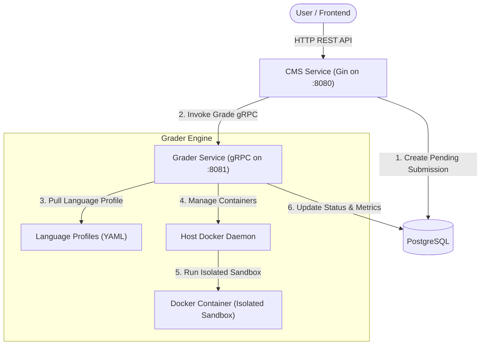

# ⚡ Gradient: Online Judge & Programming Contest Platform Backend

[](https://golang.org)
[](https://gin-gonic.github.io/gin/)
[](https://grpc.io)
[](https://www.postgresql.org)
[](https://www.docker.com)

Gradient คือระบบเบื้องหลัง (Backend Platform) ที่ออกแบบมาสำหรับระบบทำโจทย์เขียนโปรแกรมและการแข่งขันเขียนโค้ด (Online Programming Contest Platform) พัฒนาด้วยภาษา **Go** ภายใต้โครงสร้างแบบ **Microservices** ที่มีประสิทธิภาพและปลอดภัยสูง

---

## 🏗️ System Architecture



ระบบแบ่งการทำงานออกเป็น 2 เซอร์วิสหลัก:
1. **CMS Service (HTTP REST API)**: ดูแลระบบสมาชิก (Authentication), การจัดการโจทย์ (Problems), ชุดทดสอบตัวอย่าง (Sample Testcases) และการจัดการแข่งขัน (Contests)
2. **Grader Service (gRPC Server)**: ทำหน้าที่ตรวจซอร์สโค้ดในระบบ Sandbox ที่แยกสภาพแวดล้อมออกจากระบบหลัก (Isolated Docker Container Sandbox) ป้องกันโค้ดอันตราย (Malicious Code Execution) พร้อมจำกัดทรัพยากร (Resource Limits) ทั้ง Memory Limit และ Time Limit (Time Limit Exceeded - TLE)

---

## 📁 Project Directory Structure

```text
gradient-backend/
├── apps/
│   ├── cms-service/            # เซอร์วิสหลักที่ดูแลจัดการผู้ใช้งานและ API
│   │   ├── client/             # ตัวเชื่อมต่อ gRPC Client ไปหา Grader Service
│   │   ├── config/             # จัดการโหลด Environment Variables
│   │   ├── handler/            # API Controllers แยกตาม Domain (auth, problem, contest, submission)
│   │   ├── repository/         # PostgreSQL DB Access แยกตาม Domain (auth, problem, contest, submission)
│   │   ├── router/             # ตัวจัดการเส้นทางแยกตามโมดูล (Auth, Problem, Contest, Sub)
│   │   └── main.go             # จุดเริ่มต้นรัน CMS Service
│   │
│   ├── grader-service/         # เซอร์วิสตรวจโค้ด (Grader Engine)
│   │   ├── config/             # โหลดค่าคอนฟิกและ Sandbox Profiles (YAML)
│   │   ├── engine/             # ระบบรันซอร์สโค้ดใน Docker Sandbox
│   │   ├── handler/            # gRPC Service Handler
│   │   ├── repository/         # อัปเดตผลลัพธ์การตรวจ (Status & Metrics) กลับลงฐานข้อมูล
│   │   └── main.go             # จุดเริ่มต้นรัน Grader Service
│   │
│   └── shared/                 # แพ็คเกจและโมเดลที่ใช้ร่วมกัน
│       ├── model/              # โครงสร้างตารางและ Database Models
│       └── proto/              # Grader Protobuf Definition และโค้ดภาษา Go ที่ถูกเจเนอเรต
│
├── database/                   # โฟลเดอร์เก็บ SQL Schema
│   └── schema.sql              # สคริปต์สำหรับนำเข้าโครงสร้างตารางข้อมูล
├── .env                        # คอนฟิกูเรชันสภาวะแวดล้อมสำหรับรันภายในเครื่อง
├── docker-compose.yml          # ไฟล์รวมบริการรันผ่าน Docker Compose
└── README.md                   # เอกสารคู่มือใช้งาน
```

---

## 🛠️ Prerequisites & Setup

ก่อนเริ่มต้นใช้งาน กรุณาตรวจสอบและเตรียมโปรแกรมเหล่านี้ในเครื่องของคุณ:

* **Go (v1.26+)** 
* **Docker / Docker Desktop** (จำเป็นต้องรันเพื่อให้ระบบ Grader สามารถสร้าง Sandbox Container ได้)
* **PostgreSQL (v15+)** (หากเลือกรันแบบโลคัลพัฒนา)

### 1. การนำเข้า Database Schema

หากคุณติดตั้งฐานข้อมูลเอง ให้สร้างฐานข้อมูลชื่อ `gradient` แล้วรันสคริปต์ SQL นี้:

```bash
psql -u username -d gradient -f database/schema.sql
```

### 2. ตั้งค่าสภาพแวดล้อม (Environment Config)

คัดลอกไฟล์ `.env.example` เพื่อสร้างไฟล์ `.env` สำหรับกำหนดการตั้งค่า:

```bash
cp .env.example .env
```

จากนั้นแก้ไขรายละเอียดในไฟล์ `.env` ให้ตรงกับระบบฐานข้อมูลของคุณ เช่น `POSTGRES_USER`, `POSTGRES_PASSWORD` และกำหนด `JWT_SECRET`

---

## 🚀 How to Run

> [!IMPORTANT]
> **ระบบ Grader จำเป็นต้องมี Docker Daemon เปิดใช้งานอยู่เสมอ** ไม่ว่าจะเลือกรันผ่าน Docker Compose หรือรันบนเครื่องปกติ (Local)

### วิธีที่ 1: รันด้วย Docker Compose (แนะนำและรวดเร็วที่สุด)

วิธีนี้จะเริ่มการทำงานของ PostgreSQL, Grader Service, และ CMS Service พร้อมสร้างฐานข้อมูลและตารางเริ่มต้นให้อัตโนมัติ:

```bash
docker-compose up --build
```

* **CMS HTTP API** จะพร้อมใช้งานที่ `http://localhost:8080`
* **Grader gRPC Service** จะทำงานอยู่เบื้องหลังที่พอร์ต `localhost:8081`
* **PostgreSQL** จะเก็บข้อมูลและ Import Schema เริ่มจาก [database/schema.sql](file:///Users/kong/Documents/Project/gradient-backend/database/schema.sql) ลงในฐานข้อมูลให้อัตโนมัติ

---

### วิธีที่ 2: รันแบบพัฒนาทั่วไป (Local Go Development)

**1. รัน Grader Service (gRPC)**
เปิด Terminal ที่ 1 แล้วรันคำสั่ง:

```bash
go run apps/grader-service/main.go
```

**2. รัน CMS Service (HTTP REST API)**
เปิด Terminal ที่ 2 แล้วรันคำสั่ง:

```bash
go run apps/cms-service/main.go
```

---

## 📡 API Endpoints Summary

ทุก ๆ เส้นทาง API (ยกเว้น Register และ Login) จำเป็นต้องส่ง JWT Token ใน Header รูปแบบ: `Authorization: Bearer <your-jwt-token>`

| Route | Method | Access Role | Description |
|---|---|---|---|
| **`/api/auth/register`** | `POST` | Public | สมัครสมาชิกผู้ใช้งานใหม่ |
| **`/api/auth/login`** | `POST` | Public | เข้าสู่ระบบเพื่อรับ JWT Token |
| **`/api/auth/me`** | `GET` | Student / Teacher / Admin | ดูข้อมูลผู้ใช้งานปัจจุบันที่ล็อกอินอยู่ |
| **`/api/problems`** | `GET` | Student / Teacher / Admin | แสดงรายการโจทย์ (นักเรียนจะเห็นเฉพาะข้อที่เผยแพร่แล้ว) |
| **`/api/problems/:id`** | `GET` | Student / Teacher / Admin | แสดงรายละเอียดข้อมูลโจทย์และข้อมูลตัวอย่าง |
| **`/api/problems/:id/testcases`**| `GET` | Student / Teacher / Admin | ดูชุดทดสอบ (นักเรียนจะเห็นเฉพาะชุดทดสอบตัวอย่าง) |
| **`/api/problems`** | `POST` | Teacher / Admin | สร้างโจทย์ใหม่ |
| **`/api/problems/:id/testcases`**| `POST` | Teacher / Admin | เพิ่มชุดทดสอบ (Testcase) สำหรับตรวจคำตอบ |
| **`/api/contests`** | `GET` | Student / Teacher / Admin | แสดงการแข่งขันทั้งหมด |
| **`/api/contests/:id`** | `GET` | Student / Teacher / Admin | แสดงข้อมูลรายละเอียดการแข่งขัน |
| **`/api/contests/:id/join`** | `POST` | Student | สมัครและเข้าร่วมการแข่งขัน |
| **`/api/contests/:id/problems`** | `GET` | Student / Teacher / Admin | ดูรายการโจทย์ในห้องแข่งขัน |
| **`/api/contests`** | `POST` | Teacher / Admin | สร้างการแข่งขันใหม่ |
| **`/api/contests/:id/problems`** | `POST` | Teacher / Admin | เพิ่มโจทย์เข้าสู่การแข่งขัน |
| **`/api/submissions`** | `POST` | Student | ส่งซอร์สโค้ดเพื่อเริ่มตรวจคำตอบ |
| **`/api/submissions/:id`** | `GET` | Student / Teacher / Admin | ติดตามและดูผลลัพธ์การตรวจ |
| **`/api/submissions`** | `GET` | Student / Teacher / Admin | ดูรายการส่งโค้ดทั้งหมด (สามารถฟิลเตอร์ด้วย Query parameters) |

---

## 🛡️ Sandbox Profiles Config

คุณสามารถกำหนด Docker Image และคำสั่งที่ใช้ในการคอมไพล์/รันโค้ดเขียนโปรแกรมได้ในไฟล์ [config/sandbox_profiles.yaml](file:///Users/kong/Documents/Project/gradient-backend/apps/grader-service/config/sandbox_profiles.yaml) เช่น:

```yaml
languages:
  cpp:
    image: gcc:13-alpine
    compile_cmd: g++ -O3 solution.cpp -o solution
    run_cmd: ./solution
  python:
    image: python:3.11-alpine
    compile_cmd: python3 -m py_compile solution.py
    run_cmd: python3 solution.py
  go:
    image: golang:1.21-alpine
    compile_cmd: go build -o solution solution.go
    run_cmd: ./solution
    .
    .
    .
  javascript:
    image: "node:20-alpine"
    compile_cmd: "node --check solution.js"
    run_cmd: "node solution.js"
    
```
